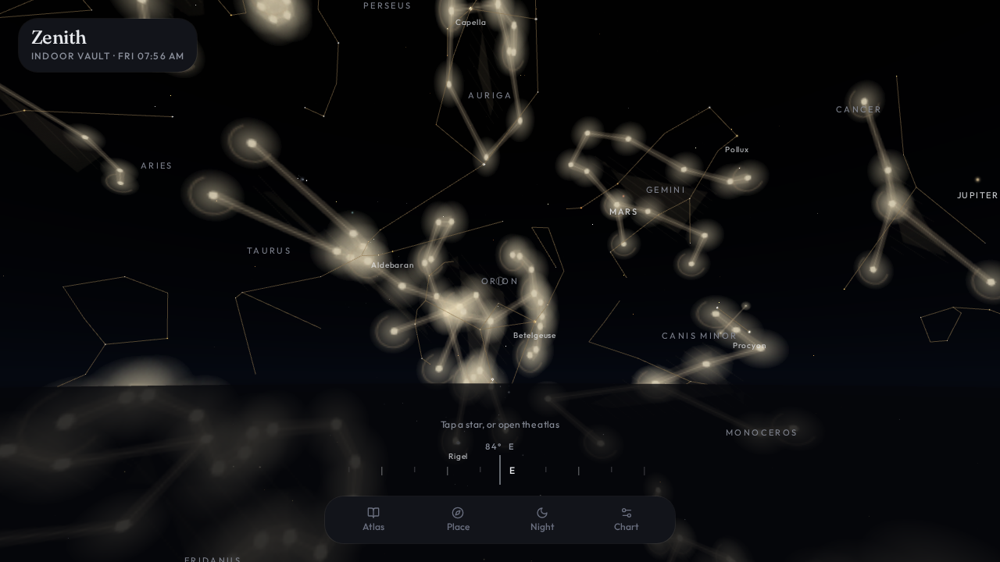
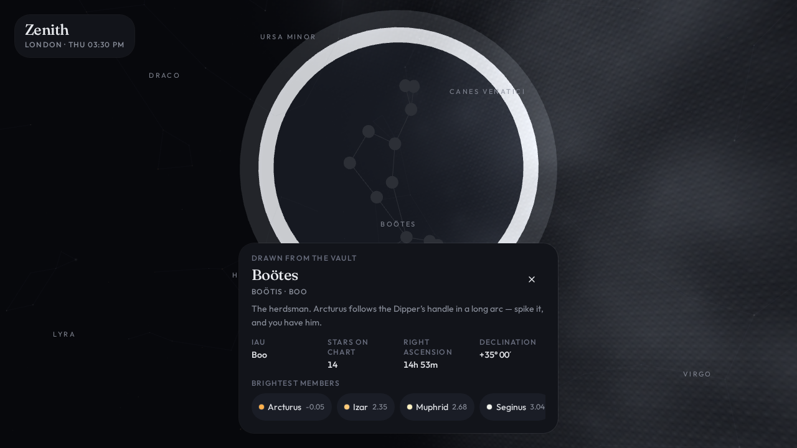
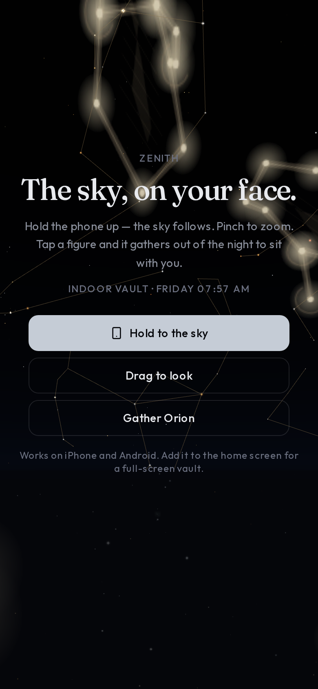

# Zenith

Hold the sky.

A WebXR planetarium for iPhone, Android, Galaxy XR, and the browser. Outdoor,
the vault is geo-aligned to your horizon. Indoor, it is a full sphere you can
turn by hand. Tap a figure and it gathers out of the night and presents in
front of you.

This is the public home of **Zenith**. The GitHub repository is named
`arconstellations`; the product is not a proof of concept.

<p align="center">
  
</p>

<p align="center">
  
  
</p>

## Why it is open

The sky is public data. Hipparcos, the IAU figures, the planets of this hour —
none of that should live behind a login. The interesting work is making those
catalogues *felt*: a phone that becomes a window, a headset that puts Orion
in the room, a figure that flies in when you ask for it.

That is a long project. Stars, mythic figures, DSOs, satellites, transients,
dark-sky layers, translations, native XR shells. It is larger than one person.
If you care about the night, you are welcome here.

The sky stays free. A later founding pass, if any, will fund hosting and art —
not lock the stars.

## What it does today

| Surface | Behaviour |
| --- | --- |
| Desktop | Drag to look, scroll or pinch to zoom, click a star or figure |
| Phone | **Hold to the sky** — gyro + compass follow the vault; pinch to zoom |
| Galaxy XR / WebXR | `immersive-ar`, local-floor, optional hand tracking |
| Outdoor | Real alt-az from latitude, longitude, and GMST; cropped at the horizon |
| Indoor | Full sphere, user-aligned, heading offset if you want to match a wall |
| Gather | Selected constellation flies in as a camera-facing medallion |
| Atlas / Place / Night / Chart | 88 IAU figures, cities + GPS, sky clock, magnitude and layers |

Catalogue in the box: **5,044** Hipparcos stars to magnitude 6, **88** IAU
figures (Serpens drawn as Caput and Cauda), Sun / Moon / planets, a first
handful of deep-sky objects, mythic figure overlays.

## Stack

- [TanStack Start](https://tanstack.com/start) + React 19
- [Three.js](https://threejs.org) r185, WebGLRenderer, WebXR
- Tailwind v4, Zustand (`zenith-sky-v2`)
- Packed catalogue: `public/data/sky.json`

There is unused auth/database scaffolding in the tree from the host this app
was born in. **Zenith does not sign anyone in.** Ignore `src/lib/auth` and
`src/lib/db.ts` unless you are ripping that scaffolding out.

## Run it

You need Node 22+.

```bash
git clone https://github.com/d-prybytak/arconstellations.git
cd arconstellations
npm install
npm run dev
```

Open the URL Vite prints. On a phone, use HTTPS (or localhost) so the browser
will grant orientation and geolocation. On Galaxy XR, open the same origin and
tap **Enter AR**.

```bash
npm run typecheck
npm run build
```

## Architecture

The product lives in two rooms:

```
src/lib/sky/          engine, astro, catalogue, device, shaders
src/components/       HUD, sheets, inspect plaque, compass, canvas host
```

Read [docs/ARCHITECTURE.md](docs/ARCHITECTURE.md) before changing the renderer
or the HUD. The short version:

- `SkyEngine` owns the WebGL scene. It is not React Three Fiber.
- Outdoor orientation is GMST → LST → alt-az. Indoor is a sphere plus heading.
- Phone follow is a device-orientation quaternion, paused when you look-at or
  enter XR.
- Serpens Caput and Cauda share the IAU id `Ser`. React keys must be
  `${id}-${name}`.

## Contributing

Please read [CONTRIBUTING.md](CONTRIBUTING.md). Issues and pull requests in
English or Russian are both fine. If you work with Claude Code, start it in
the repo root — [CLAUDE.md](CLAUDE.md) is the brief it should follow.

Good first issues:

1. A missing constellation blurb in `src/lib/sky/copy.ts`
2. One more deep-sky object in `src/lib/sky/bodies.ts`
3. A unit test for `lstHours` / `equatorialToAltAz` in `src/lib/sky/astro.ts`
4. HUD copy for a second language
5. A fatter WebXR pinch/pick on hand tracking

## Data & license

Code is [MIT](LICENSE). Catalogue provenance is in [NOTICE.md](NOTICE.md).
Please keep the Hipparcos and IAU acknowledgments if you redistribute
`sky.json`.

## Roadmap (the long night)

- Richer mythic figures and a true Milky Way photometry layer
- Satellites / ISS, meteor-shower radiants, live transients
- Native Android XR (Jetpack XR) and a store-wrapped iOS shell
- Open catalogues from ESA, NASA, CDS — visualized, not dumped as tables

If that is the project you wanted to exist, open an issue and pick a star.
